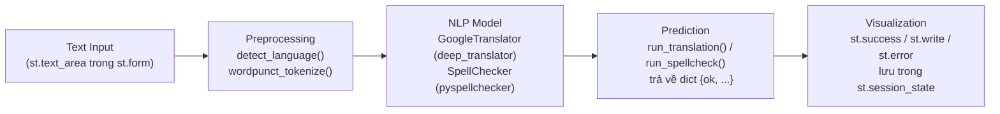
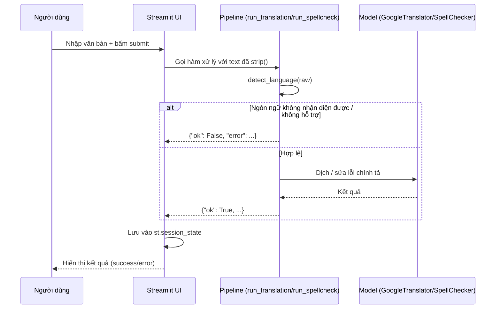

# Streamlit NLP Pipeline Demo

Ứng dụng minh họa một **pipeline NLP cơ bản** được đóng gói bằng giao diện web [Streamlit](https://streamlit.io/), gồm hai tác vụ:

- 🌐 **Dịch văn bản** — phát hiện ngôn ngữ nguồn tự động và dịch sang một trong 7 ngôn ngữ đích.
- ✍️ **Sửa lỗi chính tả** — phát hiện ngôn ngữ, tokenize câu, và gợi ý sửa các từ sai chính tả.

> Trong dự án này, **Streamlit chỉ đóng vai trò là lớp giao diện**: nơi người dùng nhập văn bản, chọn tác vụ, chạy mô hình/pipeline xử lý ngôn ngữ, và quan sát kết quả. Toàn bộ phần xử lý NLP thực sự vẫn là code Python thuần (không phụ thuộc vào Streamlit).

## Mục lục

- [Kiến trúc pipeline](#kiến-trúc-pipeline)
- [Tính năng](#tính-năng)
- [Công nghệ sử dụng](#công-nghệ-sử-dụng)
- [Cài đặt](#cài-đặt)
- [Chạy ứng dụng](#chạy-ứng-dụng)
- [Cấu trúc thư mục](#cấu-trúc-thư-mục)
- [Giải thích luồng xử lý](#giải-thích-luồng-xử-lý)
- [Giới hạn hiện tại](#giới-hạn-hiện-tại)


## Kiến trúc pipeline

Một pipeline NLP cơ bản trong ứng dụng này đi theo mô hình:

```
Text Input → Preprocessing → NLP Model → Prediction → Visualization
```

Ánh xạ cụ thể vào code trong `app.py`:



Diễn giải từng bước:

1. **Text Input** — Người dùng nhập câu vào `st.text_area`, chọn ngôn ngữ đích (tab Dịch) hoặc bấm nút kiểm tra (tab Sửa lỗi chính tả). Cả hai được bọc trong `st.form` để tránh chạy lại pipeline mỗi khi người dùng gõ phím.
2. **Preprocessing** — `detect_language()` dùng `langdetect` để nhận diện ngôn ngữ nguồn; ở tác vụ sửa lỗi, câu còn được tách token bằng `wordpunct_tokenize` (giữ dấu câu riêng biệt để không "sửa nhầm" dấu câu).
3. **NLP Model** — Với dịch thuật là `GoogleTranslator` của `deep_translator` (gọi Google Translate); với sửa lỗi là `SpellChecker` của `pyspellchecker`, được cache bằng `st.cache_resource` để không phải nạp lại từ điển mỗi lần chạy.
4. **Prediction** — `run_translation()` / `run_spellcheck()` tổng hợp kết quả thành một `dict` thống nhất dạng `{"ok": True/False, ...}`, giúp phần giao diện chỉ cần rẽ nhánh theo `ok` mà không cần `try/except`.
5. **Visualization** — Kết quả được hiển thị lại bằng các widget của Streamlit (`st.success`, `st.write`, `st.info`, `st.error`) và được lưu trong `st.session_state` để không bị mất khi Streamlit rerun toàn bộ script sau mỗi tương tác.

## Tính năng

**Tab "Dịch văn bản"**
- Tự động phát hiện ngôn ngữ nguồn.
- Dịch sang 1 trong 7 ngôn ngữ: Tiếng Việt, Anh, Pháp, Nhật, Trung (giản thể), Hàn, Đức.
- Bỏ qua việc gọi API dịch nếu ngôn ngữ nguồn trùng ngôn ngữ đích.

**Tab "Sửa lỗi chính tả"**
- Hỗ trợ 10 ngôn ngữ có sẵn từ điển trong `pyspellchecker`: `en, es, fr, pt, de, ru, ar, eu, lv, nl`.
- Giữ nguyên kiểu viết hoa gốc của từ (Title Case / ALL CAPS) sau khi sửa.
- Không sửa số và dấu câu, chỉ sửa các token là chữ cái.
- Thông báo rõ ràng khi ngôn ngữ phát hiện được không nằm trong danh sách hỗ trợ.

## Công nghệ sử dụng

| Thành phần | Thư viện | Vai trò |
|---|---|---|
| Giao diện | [`streamlit`](https://streamlit.io/) | Form nhập liệu, tab, hiển thị kết quả |
| Dịch thuật | [`deep-translator`](https://github.com/nidhaloff/deep-translator) | Gọi Google Translate |
| Nhận diện ngôn ngữ | [`langdetect`](https://github.com/Mimino666/langdetect) | Phát hiện ngôn ngữ nguồn |
| Tokenize | [`nltk`](https://www.nltk.org/) (`wordpunct_tokenize`, `TreebankWordDetokenizer`) | Tách/ghép token |
| Sửa lỗi chính tả | [`pyspellchecker`](https://github.com/barrust/pyspellchecker) | Gợi ý sửa từ sai |

## Cài đặt

Yêu cầu Python 3.9+.

```bash
# 1. Clone repo
git clone https://github.com/<your-username>/<your-repo>.git
cd <your-repo>

# 2. Tạo virtual environment (khuyến nghị)
python -m venv venv
source venv/bin/activate      # Windows: venv\Scripts\activate

# 3. Cài dependencies
pip install -r requirements.txt
```

## Chạy ứng dụng

```bash
streamlit run app.py
```

Mặc định Streamlit sẽ mở ứng dụng tại `http://localhost:8501`.

> **Lưu ý:** tính năng dịch thuật gọi Google Translate qua `deep_translator`, cần có kết nối Internet để hoạt động.

## Cấu trúc thư mục

```
.
├── app.py             # Toàn bộ logic + giao diện Streamlit
├── requirements.txt    # Danh sách thư viện phụ thuộc
├── LICENSE
├── .gitignore
└── README.md
```

## Giải thích luồng xử lý

Sơ đồ chi tiết cho từng tab:



## Giới hạn hiện tại

- `pyspellchecker` chỉ hỗ trợ 10 ngôn ngữ (xem `SPELL_LANGS` trong `app.py`); các ngôn ngữ khác (kể cả tiếng Việt) chưa có tính năng sửa chính tả.
- Việc dịch phụ thuộc vào Google Translate không chính thức thông qua `deep_translator`, có thể bị giới hạn tốc độ (rate limit) hoặc lỗi khi mất kết nối mạng.
- `langdetect` có thể nhận diện sai với câu quá ngắn hoặc pha trộn nhiều ngôn ngữ.


